Mapa dels Béns Culturals d'Interès Nacional amb CartoDB
=======================================================

Els amics de la Viquipèdia han inventariat tots els Béns Culturals d'Interès Nacional (BCIN) de Catalunya [#]_, enllaçant-los amb articles i fotografies.

.. [#] http://ca.wikipedia.org/wiki/Categoria:Llistes_de_B%C3%A9ns_Culturals_d%27Inter%C3%A8s_Nacional

L'objectiu d'aquest exercici és crear un mapa amb aquest patrimoni, utilitzant un compte gratuït de CartoDB.

Mapa bàsic
----------

Podem crear el mapa en un minut, seguint aquests tres senzills passos:

1. Crear un compte a CartoDB

  Accediu a http://cartodb.com i registreu-vos clicant a "Sign up now".

  .. image:: img/cartodb_signup.png

2. Pujar les dades

  Pujar dades és extremadament senzill. Podeu:

  * Arrossegar un fitxer que tingueu al vostre ordinador, directament sobre el web de CartoDB.
  * Vincular continguts del vostre compte de Dropbox.
  * Indicar l'adreça d'on treure les dades.

  Nosaltres farem servir aquesta tercera opció. Cliqueu a "Create your first table" i afegiu-hi la següent adreça:

    http://fonts.cat/olot-museus/dades/BCIN-wikipedia.csv

  .. image:: img/cartodb_import.png

  .. note::

    Els continguts de la Viquipèdia s'han transformat a un format tabular CSV mitjançant una petita eina, que teniu a la vostra disposició a https://github.com/oscarfonts/olot-museus/tree/master/eines/wiki2csv

  Ja tenim publicats els 2304 registres dels Béns Culturals, amb informació sobre la seva localització, època, estil, identificació i, en alguns casos, fotografia:

  .. image:: img/cartodb_table.png

  A la taula de dades, fixeu-vos especialment en la columna ``the_geom``. CartoDB l'ha creat automàticament a partir de les columnes ``lat`` i ``lon`` del fitxer CSV original. És la columna que permetrà mostrar la informació sobre un mapa.

  A la columna de la dreta teniu eines per manipular les dades: Filtrar, barrejar amb altres taules, i afegir files o columnes.

  .. note::

    També hi ha una consola SQL, que ens permet *parlar* directament amb la Base de Dades PostGIS i utilitzar tota la potència dels seus centenars de funcions [#]_. Dominar SQL està fora del nostre abast, ja que requeriria tot un curs apart, com ara aquest: http://geomati.co/postgis2.0-course/

 .. [#] http://postgis.net/docs/manual-2.0/reference.html

3. Veure el mapa

  Cliqueu a "Map view":

  .. image:: img/cartodb_defaultmap.png

  Novament, a la columna dreta teniu la consola SQL i unes quantes eines per personalitzar el mapa, que veurem a continuació.

Simbolització
-------------

Cliqueu a l'eina "Visualization wizard" (pinzell). Podreu generar estils predefinits per al vostre mapa:

* Estil simple, indicant un color, mida i vora dels cercles, i fins i tot una etiqueta.
* Categoria, assignant un color diferent en funció dels valors d'una de les columnes de dades.
* Bombolla, assignant una mida diferent a cada punt, en funció d'alguna columna numèrica.
* Intensitat, que mostra el grau de solapament entre punts amb un color més fosc.
* Densitat, que agrupa el nombre d'elements en cel·les hexagonals i hi assigna una escala de color.

Experimenteu amb les diferents opcions de simbolització.

Nosaltres proposem una simbolització per categories, a partir de la columna ``estil``. L'eina crearà uns colors per als valors més habituals, i generarà una llegenda. Els colors es poden editar per tal de comunicar millor la categoria que es vol representar.

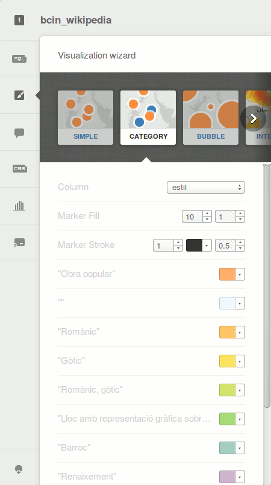

Al capdavall, aquest assistent de simbolització està generant un codi CartoCSS, similar al que es fa servir en el disseny web, i que en última instància es pot modificar a mà mitjançant l'eina específica:

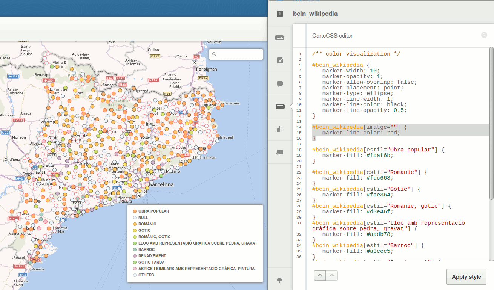

El llenguatge CartoCSS és a la visualització el que el llenguatge SQL és a les dades. Si es vol tenir un domini total sobre l'aspecte del mapa, cal conèixer-lo.

Per exemple, ens pot interessar distingir visualment aquells elements que no tenen cap fotografia associada (columna *imatge* en blanc). Per fer que apareguin amb la vora de color vermell::

	#bcin_wikipedia[imatge=""] {
	   marker-line-color: red;
	}

Consulteu la referència completa del llenguatge CartoCSS: https://www.mapbox.com/carto/api/2.1.0/

Mapa de base
------------

Des de la part superior, es pot canviar el mapa de base d'entre vuit predefinits:

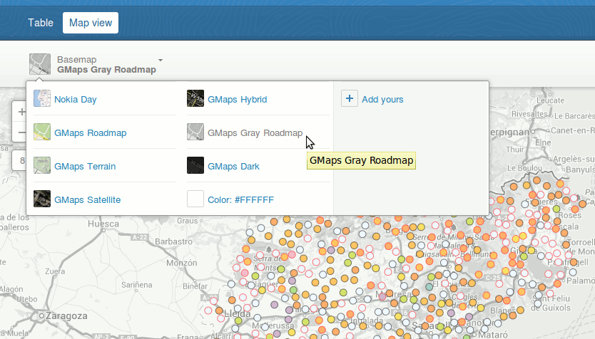

A més, es poden afegir altres mapes de base amb la opció "+ Add yours". Per exemple, podem afegir aquests serveis de mapes de l'Institut cartogràfic de Catalunya:

* Mapa topogràfic: http://mapcache.icc.cat/map/bases_noutm/wmts/topo/GRID3857/{Z}/{X}/{Y}.jpeg
* Mapa topogràfic gris: http://mapcache.icc.cat/map/bases_noutm/wmts/topogris/GRID3857/{Z}/{X}/{Y}.jpeg
* Ortofotografia aèria: http://mapcache.icc.cat/map/bases_noutm/wmts/orto/GRID3857/{Z}/{X}/{Y}.jpeg

Aquest és un exemple amb l'ortofoto de l'ICC:

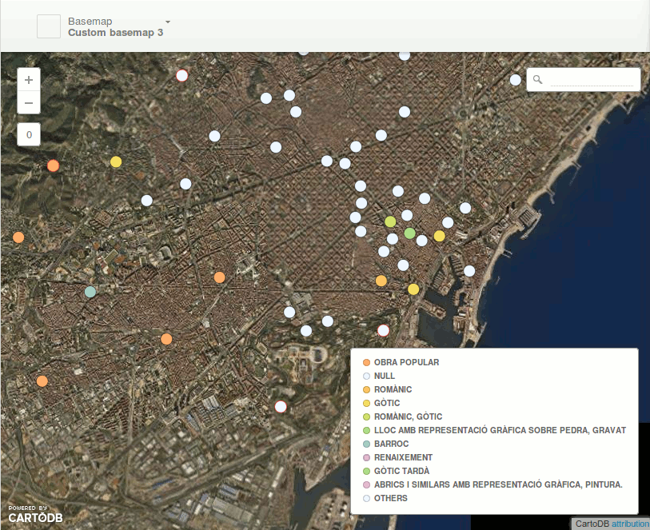

Info
----

També podem configurar l'aspecte del globus emergent en clicar sobre un element. Des de l'eina *infowindow*, se'ns proposen diferents dissenys, l'últim dels quals, *image header*, permet afegir-hi una imatge a la capçalera.

Cal arrossegar la columna "imatge" al primer lloc de la llista, i la columna "nomcoor" al segon lloc, perquè s'utilitzi com a títol. La resta de columnes es poden mostrar a continuació, amb o sense títol.

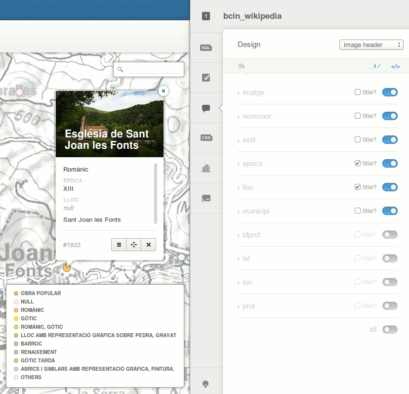

Visualitzacions
---------------

Finalment, afegirem una segona capa amb les comarques de Catalunya, i publicarem el resultat.

Torneu a la pàgina inicial de CartoDB, i afegiu-hi aquesta nova taula:

  http://fonts.cat/olot-museus/dades/comarques.zip

Es tracta d'un fitxer *shapefile* amb les comarques catalanes, provinent de la Base Municipal 1:1 000 000 de l'ICC.

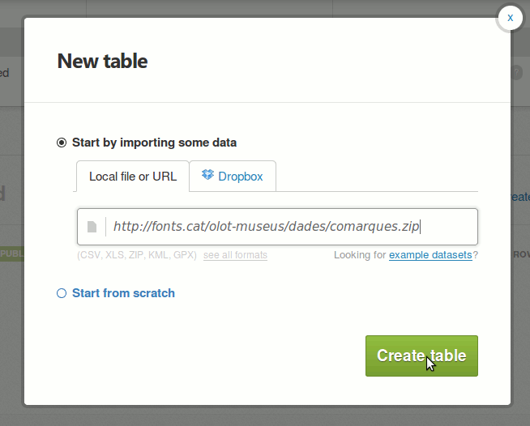

Hi aplicarem una simbolització senzilla, amb fons blanc, vora negra, i un 70% d'opacitat. També podem etiquetar les comarques:

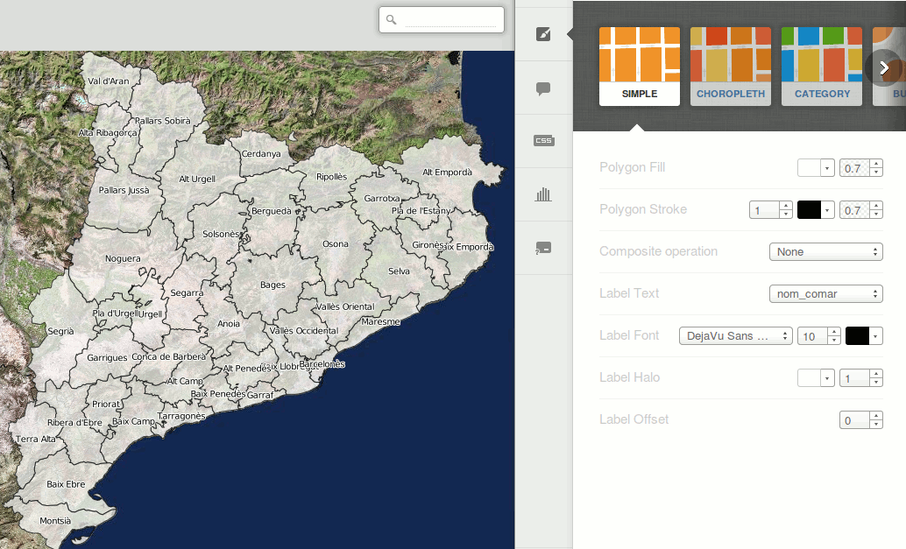

Podem aprofitar per clicar sobre el nom de la capa, a la part superior esquerra de la pantalla, i canviar el seu nom, de l'oficial "bm1000mv33sh1fpc1r170" cap a quelcom més intel·ligible, com "comarques".

Ara crearem una **visualització**. Una visualització és un mapa que conté més d'una capa de CartoDB. Per crear-la, cliqueu sobre el botó "+" que trobareu a sobre de les eines de mapa:

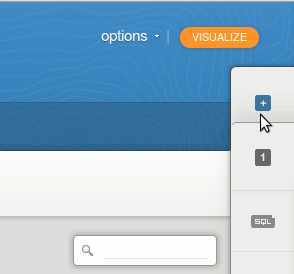

I afegiu-hi la capa "bcin-wikipedia". Us demanarà que doneu nom a la visualització:

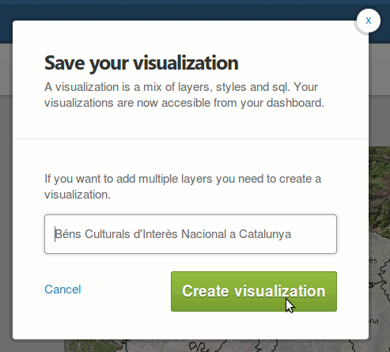

Finalment, clicant sobre el botó "publish" de la cantonada superior dreta, podem definir l'aspecte final del mapa, i publicar-lo al nostre web:

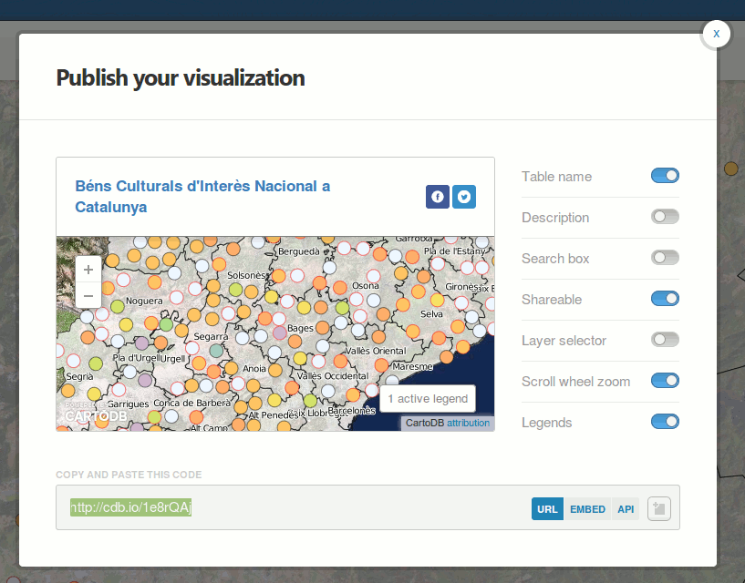

Per exemple::

  http://cdb.io/1e8uxBT

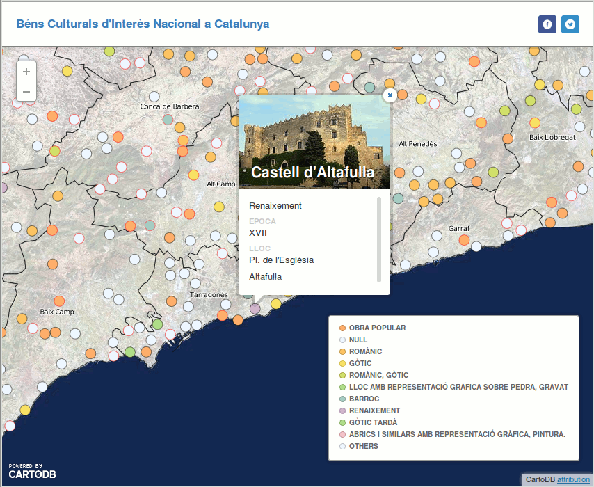
