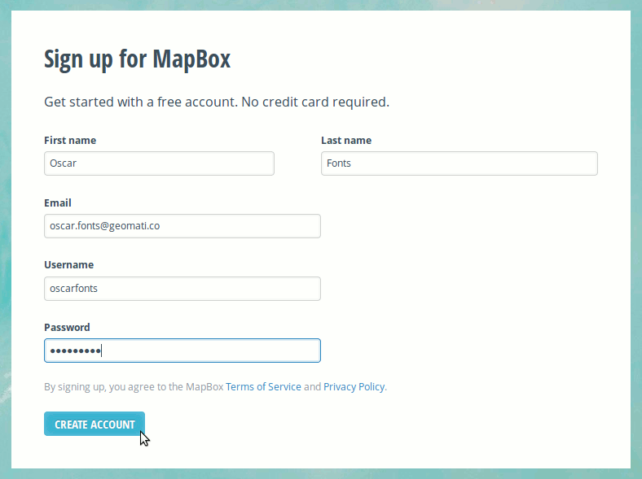
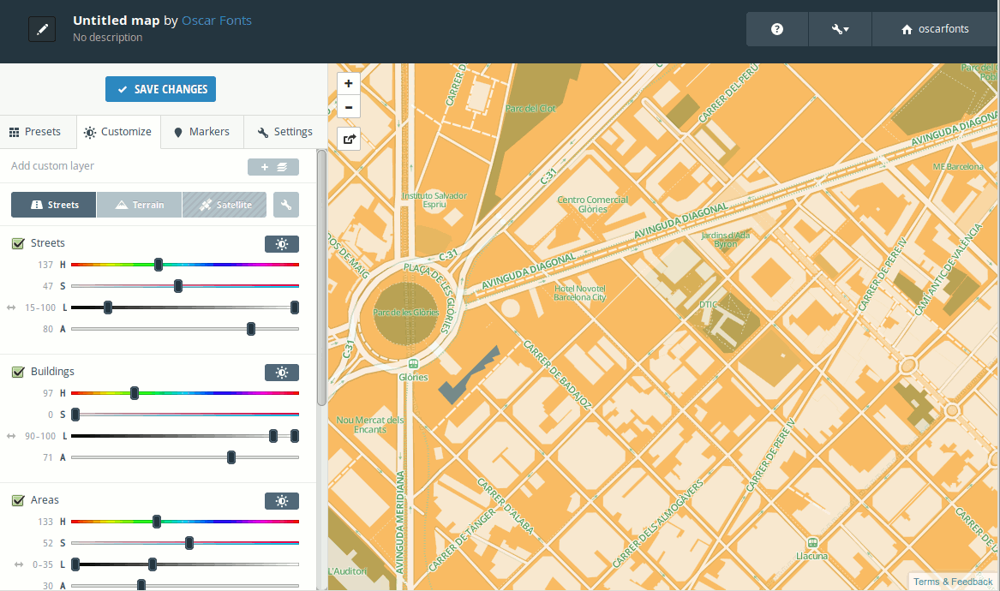
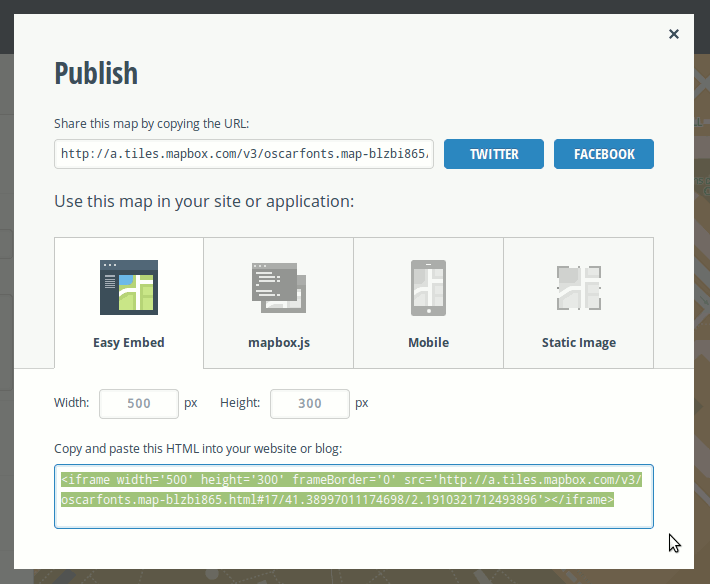
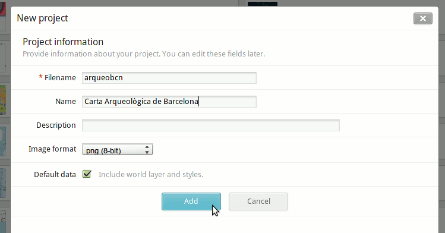
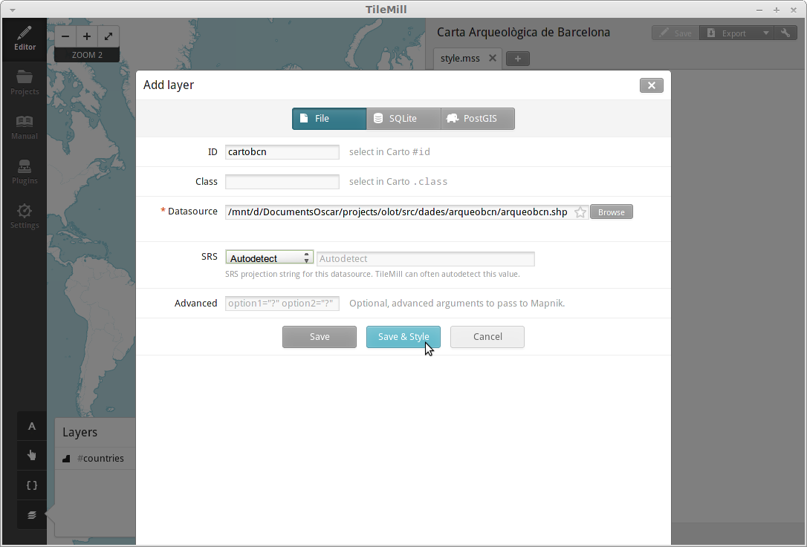

Carta Arqueològica de Barcelona amb MapBox
==========================================

MapBox és una eina d'objectius molt similars a CartoDB, però més especialitzat a generar cartografia de base.

Hi ha dues maneres de crear mapes amb MapBox:

1. En línia: Si es volen utilitzar els mapes predefinits disponibles al seu web.
2. Fora de línia: Si es volen utilitzar dades pròpies. Cal simbolitzar-les amb TileMill abans de pujar-les.

Mapes predefinits en línia
--------------------------

Com en el cas anterior, el primer és registrar-nos a http://www.mapbox.com

Des d'aquí podrem escollir si volem:

* Un carrerer
* Um mapa topogràfic
* Una fotografia de satèl·lit (bé, només si paguem!)

Escollirem un mapa de carrers (*Streets*):

Es poden escollir unes quantes combinacions de colors a la pestanya "Presets", que després es poden ajustar a "Customize":

L'eina de mapes predefinits també permet afegir alguns marcadors, i editar el títol i controls del mapa. Un cop acabat, es pot publicar el mapa mitjançant el botó "Publish":

L'ús de predefinits és prou senzill i intuïtiu, i és una manera molt ràpida de donar un "to" diferent als nostres mapes.

.. note::

   També és possible utilitzar els mapes de MapBox com a capes de fons a CartoDB, de manera que tots dos projectes s'integren! Només cal descobrir quina adreça tenen les imatges (per exemple: https://tiles.mapbox.com/v3/oscarfonts.map-blzbi865/16/33167/24476.png ), i substituïr els tres darrers números per {Z}, {X} i {Y} respectivament.

   Observeu la següent imatge:

   .. image:: img/mapbox_cartodb.png

Publicant dades pròpies via TileMill
------------------------------------

Caldrà descarregar-se les dades de la Carta Arqueològica de Barcelona (http://cartaarqueologica.bcn.cat/), publicada pel Servei d'Arqueologia de l’Institut de Cultura de Barcelona, i que hem preparat en format Shapefile per a major comoditat.

Descarregueu doncs les dades de: http://fonts.cat/olot-museus/dades/arqueobcn.zip i descomprimiu l'arxiu.

TileMill és un programa per "cuinar" els mapes que després es pujaran a MapBox. Abans de continuar, caldrà descarregar-se també TileMill des de: https://www.mapbox.com/tilemill/

Caldrà crear un nou projecte i donar-hi un nom:

Aquí l'accés a les eines més importants es troba a la cantonada inferior esquerra.

Comencem per afegir les dades a l'eina "layers":

Clicant a "save & style", ens generarà una simbolització per defecte. Podem fer Zoom a Barcelona, i eliminar la capa "countries".

Per simbolitzar, igual que a CartoDB, s'utilitza el llenguatge CartoCSS. En aquest cas, hi ha:

* Ua regla "#map" que estableix el color de fons del mapa. Poseu-lo a "transparent".
* Una regla "#countries", que no farem servir, i es pot eliminar.
* Una regla "#arqueobcn" que ...

http://a.tiles.mapbox.com/v3/oscarfonts.qwer.html#16/41.382218404313704/2.180635929107666

Map {
  background-color: transparent;
}

#arqueobcn {
  line-color: #888;
  line-width: 0.5;
  polygon-opacity: 0.3;
  polygon-fill: #ccc;
}

#arqueobcn[result="Positius. Estratigrafia exhaurida"] {
  polygon-fill:#0f0;
}

#arqueobcn[result="Positius. Estratigrafia no exhaurida"] {
  polygon-fill:#0f0;
}

#arqueobcn[result="Positius. Sense rebaix del subsòl"] {
  polygon-fill:#0f0;
}

#arqueobcn[result="Negatius. Estratigrafia no exhaurida"] {
  polygon-fill:#ff0;
}

#arqueobcn[result="Negatius. Estratigrafia exhaurida"] {
  polygon-fill:#f00;
}
