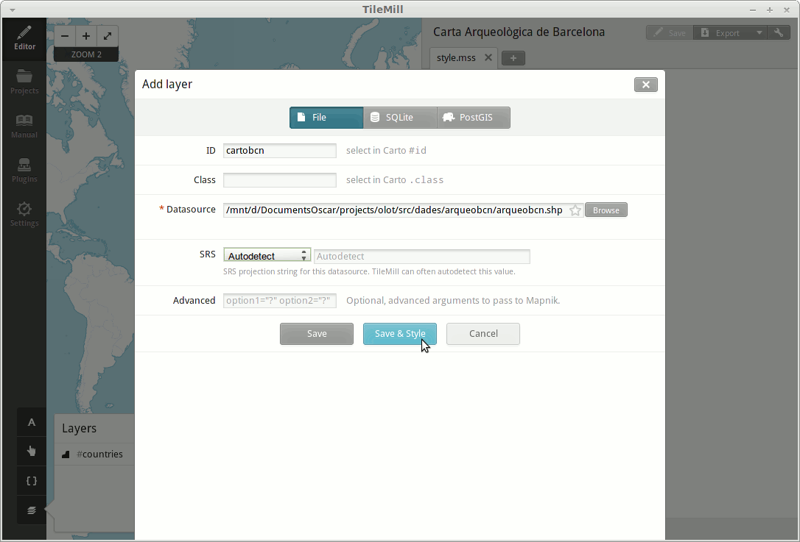

Carta Arqueològica de Barcelona amb MapBox
==========================================

MapBox és una eina d'objectius molt similars a CartoDB, però més especialitzat a generar cartografia de base.

Hi ha dues maneres de crear mapes amb MapBox:

1. En línia: Si es volen utilitzar els mapes predefinits disponibles al seu web.
2. Fora de línia: Si es volen utilitzar dades pròpies. Cal simbolitzar-les amb TileMill abans de pujar-les.

Mapes predefinits en línia
--------------------------

Com en el cas anterior, el primer és registrar-nos a http://www.mapbox.com

.. image:: img/mapbox_signup.png
   :align: center
   :scale: 50%

Des d'aquí podrem escollir si volem:

* Un carrerer
* Um mapa topogràfic
* Una fotografia de satèl·lit (bé, només si paguem!)

Escollirem un mapa de carrers (*Streets*):

Es poden escollir unes quantes combinacions de colors a la pestanya "Presets", que després es poden ajustar a "Customize":

.. image:: img/mapbox_presets.png
   :align: center
   :scale: 50%

L'eina de mapes predefinits també permet afegir alguns marcadors, i editar el títol i controls del mapa. Un cop acabat, es pot publicar el mapa mitjançant el botó "Publish":

L'ús de predefinits és prou senzill i intuïtiu, i és una manera molt ràpida de donar un "to" diferent als nostres mapes.

.. note::

   També és possible utilitzar els mapes de MapBox com a capes de fons a CartoDB, de manera que tots dos projectes s'integren! Només cal descobrir quina adreça tenen les imatges (per exemple: https://tiles.mapbox.com/v3/oscarfonts.map-blzbi865/16/33167/24476.png ), i substituïr els tres darrers números per {Z}, {X} i {Y} respectivament.

   Observeu la següent imatge:

   .. image:: img/mapbox_cartodb.png
      :align: center
      :scale: 50%

Publicant dades pròpies via TileMill
------------------------------------

Caldrà descarregar-se les dades de la Carta Arqueològica de Barcelona (http://cartaarqueologica.bcn.cat/), publicada pel Servei d'Arqueologia de l’Institut de Cultura de Barcelona, i que hem preparat en format Shapefile per a major comoditat.

També hem hem preparat una capa amb el traçat urbà de Barcelona, per a utilitzar com a referència, provinent de la Base Topogràfica 1:25 000 de l'ICC.

Descarregueu doncs les dades de:

 * http://fonts.cat/olot-museus/dades/arqueobcn.zip
 * http://fonts.cat/olot-museus/dades/bcn-base.zip

Descomprimiu els arxius.

TileMill és un programa per "cuinar" els mapes que després es pujaran a MapBox. Abans de continuar, caldrà descarregar-se també TileMill des de: https://www.mapbox.com/tilemill/

Caldrà crear un nou projecte i donar-hi un nom:

.. image:: img/tilemill_new.png
   :align: center
   :scale: 50%

Aquí l'accés a les eines més importants es troba a la cantonada inferior esquerra.

Comencem per afegir la Base Topogràfica i la Carta Arqueològica amb l'eina "layers":

Clicant a "save & style", ens generarà una simbolització per defecte per a cada capa. Podem fer Zoom a Barcelona, i eliminar la capa "countries".

Per simbolitzar, igual que a CartoDB, s'utilitza el llenguatge CartoCSS.

En aquest cas, hi ha:

* Ua regla "#map" que estableix el color de fons del mapa. Poseu-lo a "white".
* Una regla "#countries", que no farem servir. Elimineu-la.
* Unes regles "#arqueobcn" i "#bcnbase" amb uns colors generats automàticament, i que afinarem a continuació.

Per a la Base Topogràfica, establirem un color de línia "#888", que es correspòn a un gris, i un gruix de 0.5::

  #bcnbase {
    line-color: #888;
    line-width: 0.5;
  }

Per als polígons de la Carta Arqueològica farem servir el mateix estil de línia. Els polígons es pintaran de blau, amb una opacitat del 33%::

  #arqueobcn {
    line-color: #888;
    line-width: 0.5;
    polygon-opacity: 0.33;
    polygon-fill: blue;
  }

Finalment, definirem unes regles de simbolització depenent del valor de la columna "result", que indica l'estat de cada jaciment. Pintarem de verd els que han donat resultats positius, de vermell els que han donat resultats negatius, i de groc aquells que, tot i donar resultats negatius, encara es poden excavar a capes més profundes. Això s'expressa en CartoCSS com::

  #arqueobcn[result="Positius. Estratigrafia exhaurida"] {
    polygon-fill: green;
  }

  #arqueobcn[result="Positius. Estratigrafia no exhaurida"] {
    polygon-fill: green;
  }

  #arqueobcn[result="Positius. Sense rebaix del subsòl"] {
    polygon-fill: green;
  }

  #arqueobcn[result="Negatius. Estratigrafia no exhaurida"] {
    polygon-fill: yellow;
  }

  #arqueobcn[result="Negatius. Estratigrafia exhaurida"] {
    polygon-fill: red;
  }

El resultat:

Amb l'eina "Templates" podem definir certs elements extra, com la llegenda i l'eina d'informació sobre els continguts del mapa.

A l'apartat "Legend", afegiu-hi aquest contingut HTML::

  
Resultats positius

  
Resultats negatius, estratigrafia no exhaurida

  
Resultats negatius, estratigrafia exhaurida

  
Altres

A l'apartat "Teaser", aquest altre::

  <h3>{{{name}}} {{{sinName}}}</h3>
  
{{{address}}} ({{{district}}})

  
{{{result}}}

La funció "teaser" mostrarà les propietats de cada jaciment només passant-hi el cursor del ratolí per sobre. És una manera molt ràpida i còmoda d'inspeccionar els continguts del mapa.

Abans de la publicació final, definirem algunes propietats del mapa. És important limitar el nivell màxim de zoom i l'extensió geogràfica, ja que de seguida podem generar una quantitat inassumible de dades (el compte gratuït de MapBox permet pujar-ne, com a màxim, 50 MB). També podrem posarhi un títol, i escollir el zoom inicial del mapa.

Un cop definides les propietats, podem anar a "Export" > "Upload" per publicar el resultat a MapBox.

.. warning::

   Publicar les dades a MapBox és un procés lent i costós, que consumeix molta xarxa. Es recomana NO fer la publicació durant el taller, ja que serem 20 persones i col·lapsarem la xarxa!

Aquest és l'aspecte final del mapa pujat a MapBox:

  http://a.tiles.mapbox.com/v3/oscarfonts.arqueobcn.html#17/41.38277/2.17748

